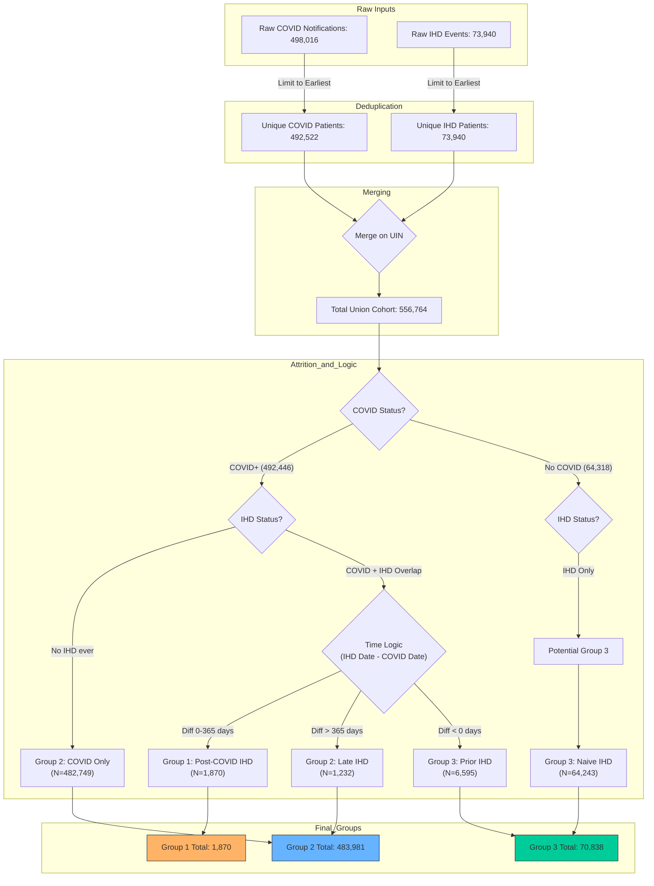

# hi

```mermaid
graph TD
    subgraph Raw Inputs
        A["Raw COVID Notifications: 498,016"]
        B["Raw IHD Events: 73,940"]
    end

    subgraph Deduplication
        A -->|Limit to Earliest| C["Unique COVID Patients: 492,522"]
        B -->|Limit to Earliest| D["Unique IHD Patients: 73,940"]
    end

    subgraph Merging
        C --> E{"Merge on UIN"}
        D --> E
        E --> F["Total Union Cohort: 556,764"]
    end

    subgraph Attrition_and_Logic
        F --> G{"COVID Status?"}
        G -->|"COVID+ (492,446)"| H{"IHD Status?"}
        G -->|"No COVID (64,318)"| I{"IHD Status?"}

        I -->|IHD Only| J["Potential Group 3"]
        J --> K["Group 3: Naive IHD<br/>(N=64,243)"]

        H -->|No IHD ever| L["Group 2: COVID Only<br/>(N=482,749)"]
        H -->|COVID + IHD Overlap| M{"Time Logic<br/>(IHD Date - COVID Date)"}

        M -->|Diff 0-365 days| N["Group 1: Post-COVID IHD<br/>(N=1,870)"]
        M -->|Diff > 365 days| O["Group 2: Late IHD<br/>(N=1,232)"]
        M -->|Diff < 0 days| P["Group 3: Prior IHD<br/>(N=6,595)"]
    end

    subgraph Final_Groups
        N --> G1_Final["Group 1 Total: 1,870"]
        L --> G2_Final["Group 2 Total: 483,981"]
        O --> G2_Final
        K --> G3_Final["Group 3 Total: 70,838"]
        P --> G3_Final
    end

    style G1_Final fill:#ffb366,stroke:#333
    style G2_Final fill:#66b3ff,stroke:#333
    style G3_Final fill:#00cc99,stroke:#333
```
