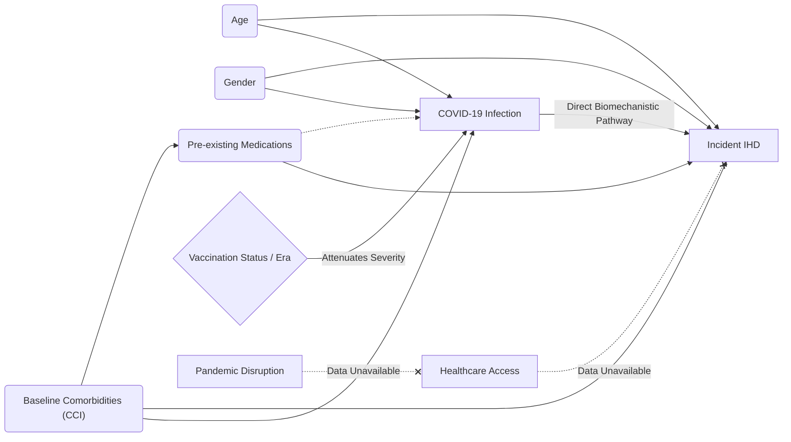
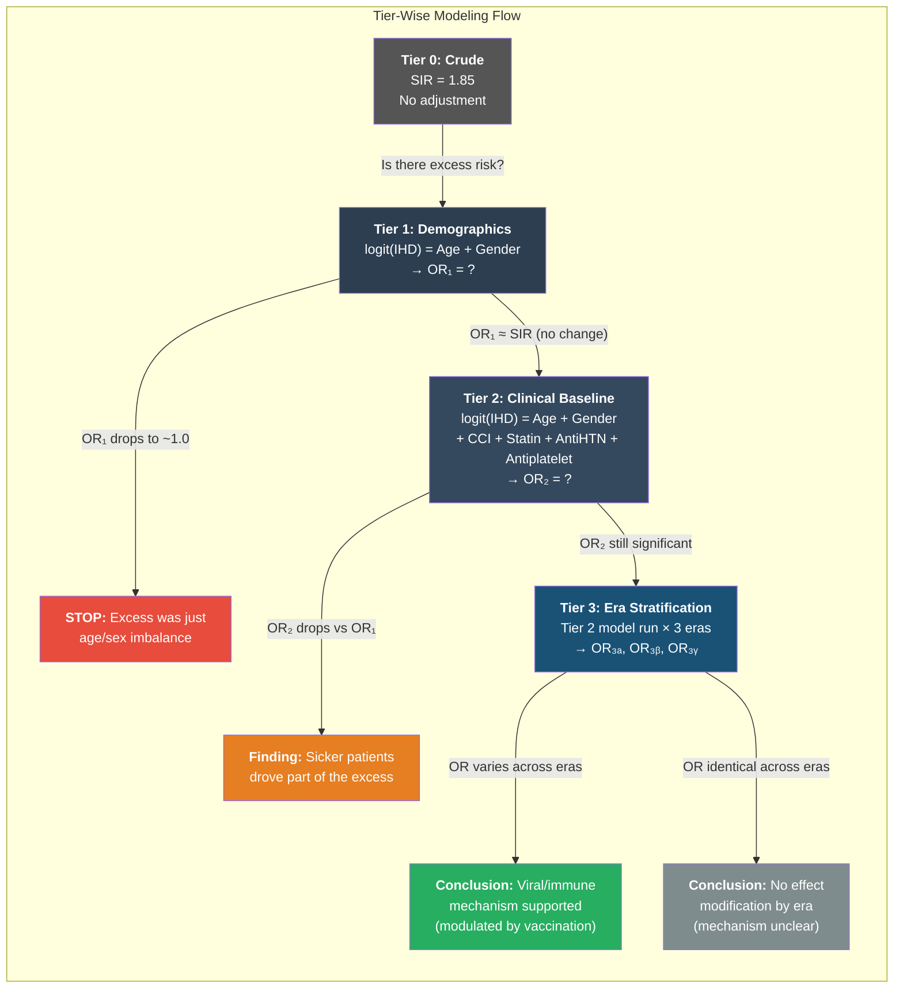
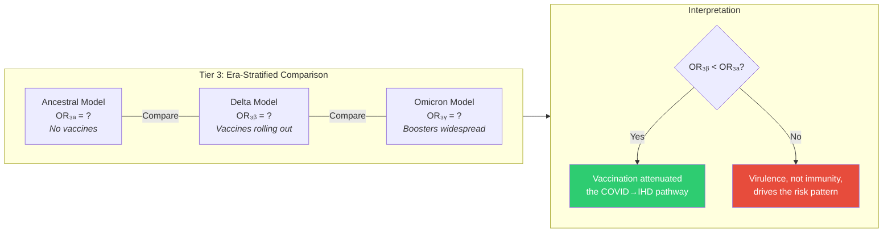

# Simplified Tier-Wise Analysis Plan & DAG Framework

**Prepared for Presentation and Review**

## 1. Executive Summary & Objective

The objective of this revised analysis plan is to provide a **feasible, data-driven, and step-by-step ("tier-wise") approach** to understanding the established ~85% excess Ischemic Heart Disease (IHD) risk observed in the post-COVID-19 cohort (SIR ~1.85).

Based on recent epidemiological review, this plan prioritises:

1. **Simplicity and Transparency:** Avoiding overly complex statistical acrobatics in favour of a clear, stepwise addition of covariates.
2. **Strict Adherence to DAG Rules:** Ensuring we only adjust for true pre-existing confounders, not mediators or downstream variables.
3. **Data Reality Check:** Acknowledging systemic unmeasurable factors (like healthcare access disruption) as formal residual confounders in our theoretical model, rather than attempting to synthesise them without robust local data.
4. **Clinical Phenotyping:** Shifting focus towards how COVID-induced IHD differs from typical IHD in terms of presentation and mortality trajectories.

---

## 2. The Theoretical Model (DAG)

To communicate our assumptions clearly to reviewers, we must map the causal pathways using a Directed Acyclic Graph (DAG).

**Rule of Thumb:** We adjust _only_ for factors that cause BOTH the exposure (COVID severity/infection) and the outcome (IHD), and which exist _prior_ to the infection.

### 2.1 The Simplified Causal Map



### 2.2 Key Diagram Rules & Decisions

- **True Confounders (Adjusted):** Age, Gender, Baseline Comorbidities (CCI), and Pre-existing Medications. These must be added to the model to see if they "explain away" the excess risk.
- **Vaccination is NOT a Baseline Covariate:** Vaccination status depends on the timing of the COVID infection (era) and influences the trajectory of the disease. Therefore, we do not simply dump "Vaccination" into a logistic regression alongside Age and Gender. Instead, we use **stratification** (e.g., assessing the risk within the Delta vs Omicron eras as proxies for vaccination coverage).
- **Data Limitations:** The Pandemic Disruption pathway (avoiding hospitals, missed chronic care) is a valid theoretical alternative to the direct biomechanistic pathway. However, lack of granular local data means we cannot model it. We will present this in the diagram as broken lines, formally acknowledging it as unmeasured residual confounding in the manuscript.

---

## 3. The "Stepping Stone" (Tier-Wise) Modeling Strategy

Rather than presenting one massive mathematical model, we will present the findings incrementally. At each step, we evaluate: _Did adding this factor make the COVID risk disappear, or does it remain?_

**Baseline finding:** Overall SIR = 1.85 (Ancestral = 2.51, Delta = 1.59, Omicron = 2.08)



---

### Tier 1: Demographic Adjustment

**Question:** _Is the excess IHD risk simply because the COVID cohort is older or more male?_

#### Model Specification

| Component       | Detail                                                      |
| :-------------- | :---------------------------------------------------------- |
| **Population**  | All COVID patients: Group 1 (N=1,870) + Group 2 (N=483,981) |
| **Outcome (Y)** | IHD within 365 days (binary: 1 = Group 1, 0 = Group 2)      |
| **Predictors**  | Age (continuous) + Gender (binary: Male=1)                  |
| **Model Type**  | Multivariable Logistic Regression                           |

**Mathematical Formula:**

```
logit(P(IHD=1)) = β₀ + β₁(Age) + β₂(Gender_Male)
```

**Key Output:**

| Metric               | What It Tells Us                                                       |
| :------------------- | :--------------------------------------------------------------------- |
| **Intercept (β₀)**   | Baseline log-odds of IHD for a reference patient (e.g., female, age=0) |
| **OR_Age = e^β₁**    | How much does each additional year of age increase IHD odds?           |
| **OR_Gender = e^β₂** | How much higher are IHD odds for males vs. females?                    |
| **Model p-value**    | Is the overall model significant?                                      |

**What We Compare (Tier 0 → Tier 1):**

| Comparison        | Value                                                                           |
| :---------------- | :------------------------------------------------------------------------------ |
| Tier 0 (Crude)    | SIR = 1.85 (unadjusted)                                                         |
| Tier 1 (Adjusted) | Age- and Gender-adjusted OR from the model                                      |
| **Attenuation**   | `(SIR - OR₁) / (SIR - 1.0)` × 100% = % of excess risk explained by demographics |

**Interpretation Guide:**

- If OR₁ ≈ 1.80 → Demographics explain almost nothing → proceed to Tier 2
- If OR₁ ≈ 1.30 → Demographics explain ~65% of the excess → still some residual to investigate
- If OR₁ ≈ 1.05 (non-significant) → **STOP** — the excess was purely demographic confounding

---

### Tier 2: Clinical Baseline Adjustment (The "Sick Patient" Test)

**Question:** _After accounting for demographics AND pre-existing sickness, does COVID still independently increase IHD risk?_

#### Model Specification

| Component       | Detail                                                                                                              |
| :-------------- | :------------------------------------------------------------------------------------------------------------------ |
| **Population**  | Same as Tier 1: Group 1 + Group 2                                                                                   |
| **Outcome (Y)** | IHD within 365 days (binary)                                                                                        |
| **Predictors**  | Age + Gender + **CCI** (continuous, 0–37) + **Statin** (binary) + **Anti-HTN** (binary) + **Antiplatelet** (binary) |
| **Model Type**  | Multivariable Logistic Regression                                                                                   |

**Mathematical Formula:**

```
logit(P(IHD=1)) = β₀ + β₁(Age) + β₂(Gender_Male)
                     + β₃(CCI)
                     + β₄(Statin) + β₅(Anti_HTN) + β₆(Antiplatelet)
```

**Key Output:**

| Metric                                      | What It Tells Us                                             |
| :------------------------------------------ | :----------------------------------------------------------- |
| **OR_CCI = e^β₃**                           | Per-unit increase in comorbidity burden → how much more IHD? |
| **OR_Statin = e^β₄**                        | Are patients on statins _before_ COVID protected from IHD?   |
| **Model AUC (C-statistic)**                 | How well does the full model discriminate G1 from G2?        |
| **Likelihood Ratio Test: Tier 2 vs Tier 1** | Does adding CCI + Meds _significantly_ improve the model?    |

**What We Compare (Tier 1 → Tier 2):**

| Comparison          | Value                                                                                   |
| :------------------ | :-------------------------------------------------------------------------------------- |
| Tier 1 OR           | Age- and Gender-adjusted OR                                                             |
| Tier 2 OR           | Fully adjusted OR (demographics + clinical)                                             |
| **Attenuation**     | `(OR₁ - OR₂) / (OR₁ - 1.0)` × 100% = % of Tier 1 residual explained by clinical factors |
| **LR Test p-value** | Is the improvement from Tier 1 → Tier 2 statistically significant?                      |

**Interpretation Guide:**

- If OR₂ ≈ OR₁ → Comorbidities and meds add no explanatory power → the risk is not driven by "sicker patients getting COVID"
- If OR₂ drops substantially → Pre-existing illness is a major contributor to the excess risk
- **The critical value is the Tier 2 OR itself:** if OR₂ > 1.0 and p < 0.05, there is a statistically significant **independent association** between being in the COVID cohort and developing IHD, even after accounting for how sick the patient was beforehand

---

### Tier 3: Era / Vaccination Stratification

**Question:** _Does the COVID→IHD risk vary by variant era (a proxy for vaccine coverage and viral virulence)? If vaccination reduces the risk, does that support a direct biomechanistic pathway?_

> [!NOTE]
> Tier 3 is not a single model with vaccination as a covariate. Per DAG rules, vaccination status is an **effect modifier** that depends on COVID timing. We therefore **stratify** and run separate models per era, then compare.

#### Model Specification

| Component       | Detail                                                                |
| :-------------- | :-------------------------------------------------------------------- |
| **Population**  | Group 1 + Group 2, **split into 3 subsets** by era                    |
| **Outcome (Y)** | IHD within 365 days (binary)                                          |
| **Predictors**  | Same as Tier 2: Age + Gender + CCI + Statin + Anti-HTN + Antiplatelet |
| **Model Type**  | Multivariable Logistic Regression × 3 (one per era)                   |

**Three Separate Models:**

```
Ancestral Era (Jan 2020 – Apr 2021):
  logit(P(IHD=1)) = β₀ₐ + β₁ₐ(Age) + β₂ₐ(Gender) + β₃ₐ(CCI) + β₄ₐ(Statin) + ...

Delta Era (May 2021 – Dec 2021):
  logit(P(IHD=1)) = β₀ᵦ + β₁ᵦ(Age) + β₂ᵦ(Gender) + β₃ᵦ(CCI) + β₄ᵦ(Statin) + ...

Omicron Era (Jan 2022 – Present):
  logit(P(IHD=1)) = β₀ᵧ + β₁ᵧ(Age) + β₂ᵧ(Gender) + β₃ᵧ(CCI) + β₄ᵧ(Statin) + ...
```

**What We Compare (Across Eras at Tier 3):**

| Era           | Vaccination Context                  | Crude SIR | Expected Tier 3 Adjusted OR   | Interpretation                                        |
| :------------ | :----------------------------------- | :-------- | :---------------------------- | :---------------------------------------------------- |
| **Ancestral** | Pre-vaccine; high virulence          | 2.51      | Highest adjusted OR           | Maximum direct viral impact on heart                  |
| **Delta**     | Mass vaccination rollout             | 1.59      | Lowest adjusted OR            | Vaccination attenuated the pathway                    |
| **Omicron**   | Boosters widespread; high prevalence | 2.08      | Intermediate-high adjusted OR | Milder per-case, but massive volume + waning immunity |



**Key Output Per Era:**

| Metric                  | What It Tells Us                                                                         |
| :---------------------- | :--------------------------------------------------------------------------------------- |
| **Adjusted OR per era** | The independent COVID→IHD risk within each era, after identical covariate adjustment     |
| **Ratio of ORs**        | OR_Ancestral / OR_Delta = how much did vaccination reduce the effect?                    |
| **AIC per model**       | Model fit comparison across eras (are different predictors important in different eras?) |
| **N events per era**    | Power check — are era-specific estimates reliable?                                       |

**Interpretation Guide:**

- If OR_Delta << OR_Ancestral: **Supports causal pathway.** Vaccination, which reduces viral pathology, also reduces cardiac sequelae. This is strong indirect evidence that the IHD risk is driven by the virus itself, not confounders.
- If all ORs are similar (~1.5): The excess risk is **constant across eras** regardless of vaccination/virulence context → suggests a non-viral mechanism (e.g., pandemic disruption, confounding).
- If OR_Omicron > OR_Delta despite higher vaccination: Suggests **waning immunity** and/or **volume effect** — the per-case risk is lower but the sheer number of infections still drives excess population-level events.

---

### Summary: Tier-Wise Comparison Table

|                     | Tier 0 (Crude)         | Tier 1 (Demographics)       | Tier 2 (Clinical)                   | Tier 3 (Era-Stratified)                   |
| :------------------ | :--------------------- | :-------------------------- | :---------------------------------- | :---------------------------------------- |
| **Adjusts for**     | Nothing                | Age, Gender                 | Age, Gender, CCI, Meds              | Age, Gender, CCI, Meds (per era)          |
| **Metric**          | SIR                    | OR₁                         | OR₂                                 | OR₃ₐ, OR₃ᵦ, OR₃ᵧ                          |
| **Population**      | COVID cohort vs Census | G1 + G2                     | G1 + G2                             | G1 + G2, split by era                     |
| **DAG variables**   | —                      | Confounders only            | Confounders + pre-existing clinical | Same + effect modification by era         |
| **Key question**    | Is there excess risk?  | Is it just age/sex?         | Is it pre-existing sickness?        | Does vaccination/virulence modulate it?   |
| **If metric→1.0**   | No excess risk         | Demographics explain it     | Sickness explains it                | N/A (comparing across eras)               |
| **If metric >>1.0** | Excess confirmed       | Independent of demographics | Independent of clinical baseline    | Differential across eras = mechanism clue |

---

## 4. COVID-IHD Phenotypic Profiling & Mortality Trajectories

If we assert that COVID-19 opens a specific biomechanistic pathway to IHD (e.g., systemic inflammation, endothelial damage), then the resulting heart attacks might look different from classic, age-related plaque rupture IHD.

We will conduct a direct phenotypic comparison between **Group 1 (COVID-induced IHD)** and **Group 3 (Naive IHD)**.

### 4.1 Phenotypic Baseline "Fingerprint"

We will create a specific "Table 2" characterising these two distinct IHD presentations.

- **Severity proxy:** Is COVID-IHD more likely to present as STEMI or NSTEMI? (Using specific I21.x ICD-10 breakdown).
- **Demographic shift:** Are COVID-IHD patients generally younger or possessing fewer traditional cardiovascular risk factors prior to their event than Naive IHD patients?

### 4.2 Mortality Trajectories (The "Lethality" Question)

A key question for clinicians and risk-stratification tools: _Is COVID-related IHD more fatal than regular IHD?_

- **Approach:** We will generate Kaplan-Meier survival curves tracking mortality _from the date of the IHD event forward_ (Post-IHD mortality), comparing Group 1 to Group 3.
- **Hypothesis:** If systemic inflammation generated by COVID persists, Group 1 may exhibit steeper initial mortality drops compared to classic IHD.
- **Clinical Utility:** Identifying whether post-COVID IHD patients require more intensive, prolonged cardiac surveillance, which could lay the groundwork for a future clinical risk score.

---

## 5. Next Steps for Implementation

1. **Calculate a continuous CCI score** from existing comorbidity flags.
2. **Execute the Tier 1 and Tier 2 Logistic Models** sequentially, documenting the Odds Ratio and p-values at each tier.
3. **Execute the Phenotypic Comparison** (Group 1 vs Group 3 characteristics and presentation types).
4. **Formalize the Mortality Trajectory analysis** (Kaplan Meier post-IHD) to answer the lethality question.
5. Compile these sequential findings into a simplified presentation deck for Dr. Vizwan.
